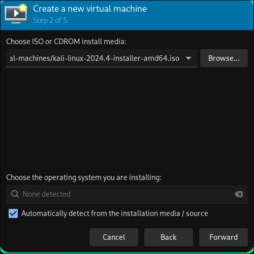
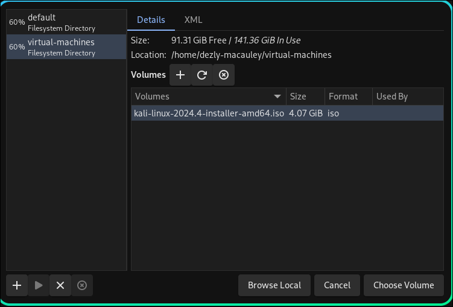
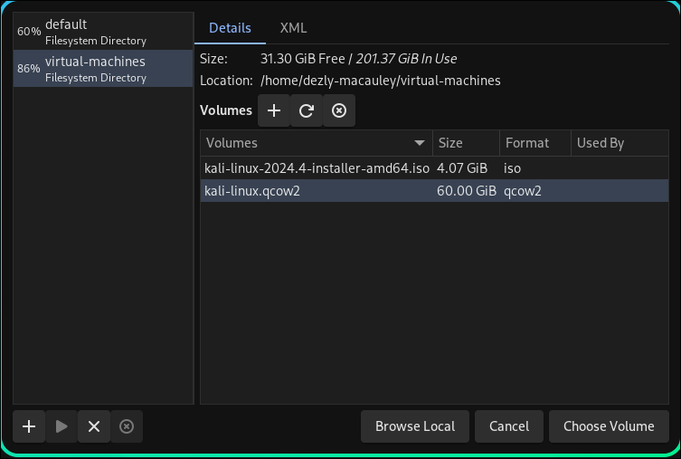

# How to run a Kali Linux on Arch Linux, using QEMU
_______________________________________________________________________________
## Step 1 - Check if your system can run virtualization technology

Use this command:
```
grep -cE '(vmx|svm)' /proc/cpuinfo
```

When I run this command, I get the following output:
```
16
```

If you get a number like `16`, that means you can run virtual machines
on your system and that you have 16 CPU cores.

_______________________________________________________________________________
If the number is `0` then that could mean one of two things:

1. That your system does not support virtualization
2. Your system does support virtualization but you need to enable 
it in your BIOS

Switch off your system. Then turn it back on, and press `F12` to enter the
menu.

Its usually a setting that says `enable virtualization`

NOTE: It's technically a UEFI these days but people still call it BIOS. 

_______________________________________________________________________________
Another command you can run to check if your system supports virtualization
is this:

```sh
grep -m 1 -oE '(vmx|svm)' /proc/cpuinfo
```

- vmx indicates Intel's virtualization technology (VT-x).

- svm indicates AMD's virtualization technology (AMD-Vi).

_______________________________________________________________________________
Or you can use this command:

```
lscpu | grep -i Virtualization
```

I get an output like this because I'm using Intel:

Virtualization:                       VT-x
_______________________________________________________________________________
## Step 2 - Install the packages needed for working with Virtual Machines

```sh
# QEMU is the virtual machine emulator
# Allows you to run different Operating Systems and architectures
sudo pacman -S --needed qemu-full

# A GUI (Graphical User Interface) tool for managing virtual machines
sudo pacman -S --needed virt-manager

# A simple tool for viewing and interacting with virtual machines
sudo pacman -S --needed virt-viewer

# A virtual network switch for virtual machines
# This is needed if you want your VMs to communicate 
# with each other or the outside network 
sudo pacman -S --needed vde2

# A tool for filtering and managing Ethernet frames at the data link layer.
# helps control how network traffic flows between virtual machines 
# and your physical network
sudo pacman -S --needed ebtables

# A tool for managing network packet filtering (firewalls) 
# and network address translation (NAT).
# It's necessary for setting up things like NAT,
# which allows your VMs to access the internet through your host machine.
sudo pacman -S --needed iptables-nft

# A modern framework for managing firewalls and network traffic, 
# replacing iptables
# It's part of the backend for modern Linux networking. 
# Even if you use iptables-nft, this is the underlying technology
sudo pacman -S --needed nftables

# A lightweight tool for DNS (Domain Name System) 
# and DHCP (Dynamic Host Configuration Protocol).
# This sets up automatic IP addresses and networking for your VMs, 
# so they can connect to the internet or talk to each other easily.
sudo pacman -S --needed dnsmasq

# Tools for creating and managing network bridges.
# A network bridge lets your VMs act 
# like they're on the same network as your host,
# which can be useful for advanced networking setups.
sudo pacman -S --needed bridge-utils

# Open Virtual Machine Firmware, which provides UEFI support 
# for virtual machines.
# Many modern operating systems require UEFI instead of BIOS. 
# This allows your VMs to boot those systems.
sudo pacman -S --needed ovmf

# A software-based TPM (Trusted Platform Module).
# Some operating systems (e.g., Windows 11) 
# require a TPM for security features. 
# This package emulates one so you can install those OSes without issues.
sudo pacman -S --needed swtpm

# For extracting `.7z` files
# Pre-built Kali Linux virtual machines are in this format
sudo pacman -S --needed 7zip 
```


_______________________________________________________________________________
## Step 3 - Configure the `libvirt daemon`

The libvirt daemon is responsible for managing virtual machines 
and other virtualization technologies on Linux.

By editing the file, you can change the permissions and group ownership
for the Unix socket that libvirt uses for communication.

Open this file:
```sh
sudo nvim /etc/libvirt/libvirtd.conf
```
_______________________________________________________________________________

Look for these lines in the file:

This setting determines which group is allowed to access the Unix socket 
used by libvirt for communication. 

By default, this is commented out and the socket is restricted to root.
```ini
# This is restricted to 'root' by default
# unix_sock_group = "libvirt"
```

Uncomment the last line so it looks like this:
```ini
# This is restricted to 'root' by default
unix_sock_group = "libvirt"
```

This allows non-root users who are in the libvirt group to interact 
with libvirt and manage virtual machines (VMs), 
without needing full root privileges.

NOTE: You will add your Arch Linux username to this later in this guide.

_______________________________________________________________________________
Next look for the following lines:
```ini
# If not using PolicyKit and setting group ownership for access
# control, then you may want to relax this too.
# unix_sock_rw_perms = "0770"
```

Uncomment the last line so it looks like this:
```ini
# If not using PolicyKit and setting group ownership for access
# control, then you may want to relax this too.
unix_sock_rw_perms = "0770"
```

This setting defines the read-write permissions for the libvirt Unix socket. 
- 0: No permissions for others (world).
- 7: Full permissions (read, write, execute) for the owner (user root).
- 7: Full permissions for the group (users in the libvirt group).

_______________________________________________________________________________
Once you have done both of the above, 
save the file.

_______________________________________________________________________________
## Step 4 - Add your user to the groups `KVM` and `libvirt`

```sh
sudo usermod -a -G kvm,libvirt $(whoami)
```

`-a` means that the user should be appended to the group.
Without this flag the command will replace all other existing users in the
group.

`-G` kvm,libvirt

kvm: The kvm group grants access to virtualization-related tasks. 
Specifically, users in the kvm group are allowed to run virtual machines 
with KVM (Kernel-based Virtual Machine) capabilities.

libvirt: The libvirt group is used to manage access to libvirt, 
a virtualization API that interfaces with hypervisors like KVM. 
Adding your user to this group allows you to manage virtual machines 
with libvirt (via tools like virt-manager).
_______________________________________________________________________________
## Step 5 - Enable the `libvirt daemon` at startup and start the service

This is ensure that the service automatically loads at boot:
```sh
sudo systemctl enable libvirtd
```

This will start the service now:
```sh
sudo systemctl start libvirtd
```
_______________________________________________________________________________
## Step 6 - Ensure that you can start virtual machines with your own user

Without this step you will have to use the root user every time you want to
start a virtual machine.

Open qemu.conf:
```
sudo nvim  /etc/libvirt/qemu.conf
```

Search for the follwing lines:
```sh
## Some examples of valid values are:
#       user = "qemu" # A user named "qemu"
#       user = "+0" # Super user (uid=0)
#       user = "100" # A  user named "100" or a user with a uid=100
# user = "libvirt-qemu"
```
Uncomment the last line, and enter your user name so that it looks like this:
```sh
## Some examples of valid values are:
#       user = "qemu" # A user named "qemu"
#       user = "+0" # Super user (uid=0)
#       user = "100" # A  user named "100" or a user with a uid=100
user = "dezly-macauley"
```
_______________________________________________________________________________
Next search for the lines:
```sh
# The group for QEMU processess run by the system instance.
# It can be specified in a similar way to user.
# group = "libvirt-qemu"
```

Uncomment these lines so that it looks like this:
```sh
# The group for QEMU processess run by the system instance.
# It can be specified in a similar way to user.
group = "dezly-macauley"
```
_______________________________________________________________________________
Save the file and restart the libvirt daemon:

```sh
sudo systemctl restart libvirtd
```
_______________________________________________________________________________
## Step 7 - Ensure that your virtual machines have a network connection

```sh
sudo virsh net-autostart default
```
_______________________________________________________________________________
## Step 7 - Ensure that dnsmasq is active and automatically loaded at boot

Without this you will have problems connecting your virtual machine to the
internet when you try to install Kali Linux on the virtual machine.

```sh
sudo systemctl enable dnsmasq
```
_______________________________________________________________________________

### Reboot your system
_______________________________________________________________________________
## Step 8 - Download a Kali Linux installer image

Go to this link:
```
https://www.kali.org/get-kali/#kali-installer-images
```


It will look something like this:
```
kali-linux-2024.4-installer-amd64.iso
```
_______________________________________________________________________________
## Step 9 - Create a `virtual-machines` directory in your home directory

```
cd ~
mkdir virtual-machines
```

And put the downloaded file inside the `virtual-machines` directory
```bash
~/virtual-machines
❯ ls
kali-linux-2024.4-installer-amd64.iso
```
_______________________________________________________________________________
## Step 10 - Open the `Virtual Machine Manager` program

You should see `QEMU/KVM` listed. 

Click on it and make sure that it is connected.


If `QEMU/KVM` is not listed for some reason.

Click `File`, then click on `Add Connection` and select `QEMU`

_______________________________________________________________________________
## Step 11 - Create a virtual machine pool

Click `File`, then click `New Virtual Machine`

Then select the option `Local install media (ISO image or CDROM)`


Then click `Forward`

_______________________________________________________________________________
Click `Browse`


_______________________________________________________________________________
Click the plus icon right at the bottom row. 

It's should display the text `Add Pool` if you hover over it.


_______________________________________________________________________________

Change the `Name` field to `virtual-machines`

And change the `Target Path` to where the `virtual-machines` 
directory is saved on your system.


Click `Finish`

_______________________________________________________________________________

You should see the `virtual-machines` directory and your 
kali-linux iso image listed under `Volumes`


Click the kali-linux iso and then click `Choose Volume`

_______________________________________________________________________________
You will be taken back to this menuu



You will notice that Where it says 
`choose the operating system you are installing`...

The option `Automatically detect from the installation media / source` 
is checked, but Virtual Machine Manager has failed to dectect Kali.
_______________________________________________________________________________

Most VM emulators will fail to automatically detect Kali because Kali Linux,
because Kali is actually a spin-off / fork of Linux distro called `Debian`.

To be even more specific, Kali Linux is based of the `testing` branch of Debian

So this is what you need to do:
1. Uncheck the option that reads 
`Automatically detect from the installation media / source`.
2. Search and select `Debian testing`


Then click `Forward`

_______________________________________________________________________________
I use this for memory and CPU settings:

- Memory: 3072 Mib
- CPUs:   2 CPU


Click `Forward`

_______________________________________________________________________________
Select the following options and click `Manage`


Click `Finish`

_______________________________________________________________________________
Now click the `+` button that is next to `Volumes`

It should say `Create new volume`



_______________________________________________________________________________
The Kali Docs recommend `60 GB` 

https://www.kali.org/docs/installation/installation-sizes/


Click `Finish`

_______________________________________________________________________________
You should now have a `.qcow2` volume listed.

This is the actual virtual machine. 

But it is currently empty, with a max size of 60 GB.



Make sure you select the .`qcow2` image (NOT the ISO!!!) and then click
`Choose Volume`

_______________________________________________________________________________
You will be taken back to this menu:


Click `Forward`

_______________________________________________________________________________
Give you virtual manchine the same name 
as the storage volume to avoid confusion.


Click `Finish`

_______________________________________________________________________________
## Step 12 - Install Kali Linux
_______________________________________________________________________________

Select your language and press `continue`


_______________________________________________________________________________

Select your location and press `continue`


_______________________________________________________________________________

Select your keyboard and press `continue`


_______________________________________________________________________________
