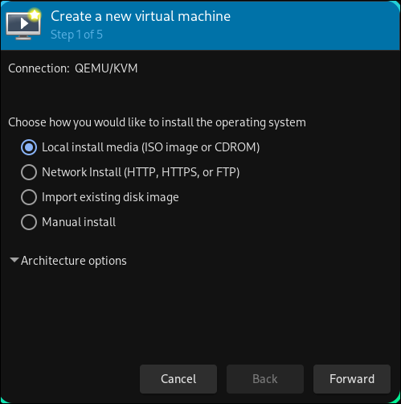
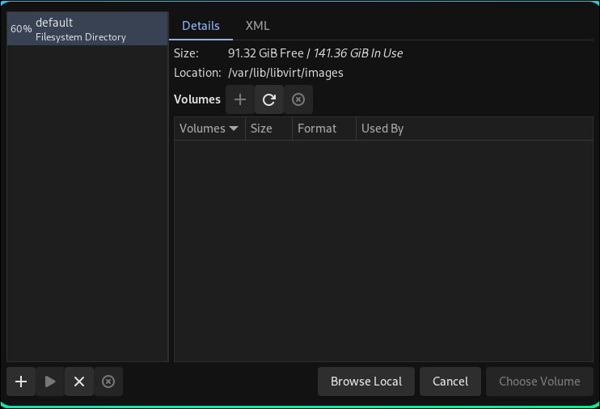

# Virtual Machine Guide
_______________________________________________________________________________
## Step 1 - Check if your system can run virtualization technology

Use this command:
```
egrep -c '(vmx|svm)' /proc/cpuinfo
```
- vmx indicates Intel's virtualization technology (VT-x).

- svm indicates AMD's virtualization technology (AMD-Vi).

If you get a number like `16`, that means you can run virtual machines
on your system and that you have 16 CPU cores.
_______________________________________________________________________________

An alternate command is this:
```
lscpu | grep -i Virtualization
```

I get an output like this:

Virtualization:                       VT-x

_______________________________________________________________________________

If the number is 0 then that means that you can't run virtualization
technology OR you can, but you need to enable it in your BIOS

Its usually a setting that says `enable virtualization`

NOTE: It's technically a UEFI but in people still call it BIOS. 
It's that menu that you get when you laptop is starting and you press F12.

_______________________________________________________________________________
## Step 2 - Install the packages needed for QEMU 

NOTE: I use Arch (by the way...) so these are the packages needed for
Arch Linux. If you are using `Dezly Kingdom`, these are already installed.

```bash
# A machine emulator and virtualizer
# By using dynamic translation, it can create virtual machines that run
# at close to native performance (which is better than VirtualBox).
# The `qemu-full` package can create virtual machines for architectures 
# outside of the usual x86_64 architecture
sudo pacman -S --needed pacman qemu-full

# A set of libraries and tools) that manages virtual machines
# libvirt interacts with QEMU behind the scenes, 
# making sure everything runs smoothly, 
# while QEMU focuses on running the virtual machine.
# It works in the background and is used by Graphical User Interfaces like
# Virt-Manager.
sudo pacman -S --needed libvirt

# A graphical user interface (GUI) for libvirt.
# It communicates with libvirt so that you don't have to enter any commands.
sudo pacman -S --needed virt-manager

# Gives your Virtual Machine an IP address 
# and handles DNS for internet access.
sudo pacman -S --needed dnsmasq 

# Controls the flow of network traffic and secures connections.
# Works with `dnsmasq` to ensure that your VM can access the internet 
# and stay protected.
sudo pacman -S --needed iptables
```
_______________________________________________________________________________
## Step 2 - Create a default network

Run this command:
```sh
echo '<network>
  <name>default</name>
  <bridge name="virbr0" stp="on" delay="0"/>
  <ip address="192.168.122.0" netmask="255.255.255.0">
    <dhcp>
      <range start="192.168.122.2" end="192.168.122.254"/>
    </dhcp>
  </ip>
</network>' | sudo tee /etc/libvirt/qemu/networks/default.xml > /dev/null
```

_______________________________________________________________________________

Then make sure to define the network
```sh
sudo virsh net-define /etc/libvirt/qemu/networks/default.xml
```

_______________________________________________________________________________

Run this command to check if it being detected:
```sh
sudo virsh net-list --all
```

The output should look like this:

```sh
 Name      State      Autostart   Persistent
----------------------------------------------
 default   inactive   no          yes
```

_______________________________________________________________________________
## Step 3 - Create start and stop functions in your `.zshrc`

Open your `.zshrc` file and add the following to the file:

```sh
function vm_services_start() {
    sudo systemctl start libvirtd.socket libvirtd-ro.socket libvirtd-admin.socket
    sudo systemctl start libvirtd dnsmasq iptables
    echo "libvirt, dnsmasq, and iptables services have been started."
    echo "You can now use Virtual Machine Manager to create and run VMs"
}

function vm_services_stop() {
    sudo systemctl stop libvirtd.socket libvirtd-ro.socket libvirtd-admin.socket
    sudo systemctl stop libvirtd dnsmasq iptables
    echo "libvirt, dnsmasq, and iptables services have been stopped."
}
```
_______________________________________________________________________________
Open the terminal and run the `vm_services_start` function like this:
```sh
vm_services_start
```

The purpose of these functions is to allow you to disable the virtual
machine functionality on your system when you are not using a virtual machine,
and to re-activate those services when you need to use a virtual machine.

_______________________________________________________________________________
Run this command to check if the network is active:
```sh
sudo virsh net-list --all
```

_______________________________________________________________________________
## Step 4 - Download a pre-built Kali Linux Virtual Machine

```
https://www.kali.org/get-kali/#kali-virtual-machines
```

Download the `QEMU` one

It will look something like this:
```
https://cdimage.kali.org/kali-2024.4/kali-linux-2024.4-qemu-amd64.7z
```
_______________________________________________________________________________
## Step 5 - Create a directory in your home directory called `virtual-machines`

```
cd ~
mkdir virtual-machines
```

And put the downloaded file inside the `virtual-machines` directory
```bash
~/virtual-machines
❯ ls
kali-linux-2024.4-qemu-amd64.7z
```
_______________________________________________________________________________
## Step 6 - Open the `Virtual Machine Manager` program

You should see `QEMU/KVM` listed. 

Click on it and make sure that it is connected.


If `QEMU/KVM` is not listed for some reason.

Click `File`, then click on `Add Connection`

_______________________________________________________________________________
## Step 7 - Create a virtual machine pool

Click `File`, then click `New Virtual Machine`



Click `Forward`

_______________________________________________________________________________

Click `Browse`


_______________________________________________________________________________

Click the plus icon right at the bottom. 

It's should display the text `Add Pool` if you hover over it.


_______________________________________________________________________________

Change the `Name` field to `virtual-machines`

And change the `Target Path` to where the `virtual-machines` 
directory is saved on your system.


Click `Finish`

_______________________________________________________________________________

You should see the `virtual-machines` directory and your
pre-built kali-linux machine listed under `Volumes`


Click the kali-linux machine and then click `Choose Volume`

_______________________________________________________________________________
You will be taken back to the `Create a new virtual machine` menu

Where it says `choose the operating system you are installing`

**Uncheck** the option that says `Automatically detect from the installation media / source`

Most VM emulators will fail to automatically detect Kali because Kali Linux,
because Kali is actually a spin-off / fork of Linux distro called `Debian`.

To be even more specific, Kali Linux is based of the `testing` branch of Debian

_______________________________________________________________________________

So click the menu and select `Debian testing`, then select `Forward`


_______________________________________________________________________________

If you get a message like this, just click `Yes`


_______________________________________________________________________________

`Choose Memory and CPU setting`

- Memory: 3072 Mib
- CPUs:   2 CPU


Click `Forward`

_______________________________________________________________________________

- Make sure that `Enable storage for this virtual machine` is **checked**

- Check the option that says create `custom storage`


Click `Manage`

_______________________________________________________________________________
Click the plus icon that is next to `Volumes`.

It should say `Create new volume`


_______________________________________________________________________________

Give it a name, and about `60GB` that is allocated immediately


Click `Finish`

_______________________________________________________________________________
Make sure to select the `qcow2` volume that you created. 

**Do not select the raw!**


Then click `Choose Volume`

_______________________________________________________________________________
You will be taken back to this screen. 

Click `Forward`


_______________________________________________________________________________

Select or create custom storage:

Chose the virtual-machines directory again

Click the + (add new volumes)

Name: kali-linux
Capacity: 50 GB

Choose the volume

_______________________________________________________________________________
